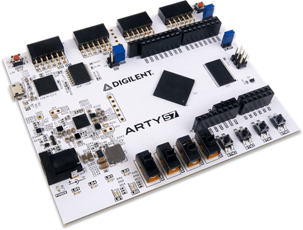
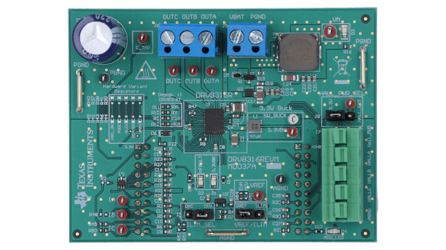
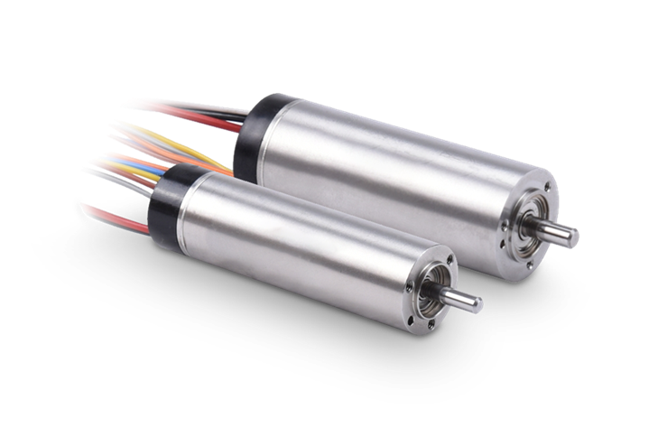

# FOC current loop for Arty S7-50 + DRV8316REVM

SystemVerilog FOC **current/torque inner loop** for a 3-phase BLDC
(Moons ECU16052H24-S002, hall feedback, 24 V bus). Zero Xilinx IP — plain
SV + raw `XADC`/`BUFG` primitives.

## Hardware

| | | |
|---|---|---|
||||

Tested on:
- Arty S7-50 (Xilinx XC7A50T-1FGG676C)
- DRV8316REVM (24 V, 100 kHz PWM, 24 V, 100 kHz Hall)
- Moons ECU16052H24-S002

## Layout

```
.
├── rtl/
│   ├── foc/    foc_pkg, clarke, park, inv_park, pi_controller, svpwm,
│   │           foc_core, foc_top, clk_rst_gen
│   ├── hall/   hall_decode, hall_angle_est (PLL observer, 12-entry cal table)
│   ├── pwm/    pwm_gen (center-aligned, dead-time, cnt_peak ADC trigger)
│   ├── spi/    drv8316_spi (config + readback-verify + fault poll)
│   ├── math/   sincos_lut (+ sincos_lut.mem from scripts/gen_sincos_lut.py)
│   ├── adc/    xadc_iface (raw XADC, dual S/H), current_offset_cal
│   └── uart/   uart_rx, uart_tx, cmd_telemetry (framed protocol + watchdog)
├── sim/        one self-checking tb_<module>.sv per module + bldc_plant
├── scripts/    simulate.sh (xsim), regress.sh, gen_sincos_lut.py
├── tcl/        build.tcl (non-project synth->bitstream), program.tcl
└── xdc/        arty_s7.xdc
```

## Simulate (Vivado xsim only)

```sh
source ~/amd/2025.2/Vivado/settings64.sh   # if xvlog is not in PATH
scripts/simulate.sh tb_foc_top             # one TB (--gui for waves)
scripts/regress.sh                         # all 20 TBs
```

## Build / program

```sh
vivado -mode batch -source tcl/build.tcl     # -> build/impl/foc_top.bit
vivado -mode batch -source tcl/program.tcl
```

## Host UART protocol (115200 8N1)

Host → FPGA: ASCII lines terminated by CR, LF or CR+LF; decimal integer
arguments, optional leading `-`. Keywords are case-insensitive but must be
spelled in full (there is no checksum, so partial matches are rejected
with `?`). Every accepted command echoes `OK` and kicks the 100 ms
watchdog (silence ⇒ iq_ref ramps to 0, gates off). ESC stops telemetry.

| Command            | Effect                                        |
|--------------------|-----------------------------------------------|
| `enable [0\|1]`    | enable/disable drive (bare = enable)          |
| `disable`          | alias for `enable 0`                          |
| `iq <int16>`       | iq_ref, Q1.15 raw (1.0 = 32767 = 1.25 A)      |
| `kp <uint16>`      | proportional gain, Q4.12                      |
| `ki <uint16>`      | integral gain, Q4.12 (Ts folded in)           |
| `cal`              | offset calibration (only while disabled)      |
| `ping`             | watchdog kick only                            |
| `tele`             | start telemetry streaming                     |
| `ol <0\|1>`        | open-loop mode                                |
| `vq <int16>`       | open-loop Vq, Q1.15                           |
| `speed <int16>`    | open-loop speed, angle codes/period           |
| `hall <idx> <ang>` | hall edge table write: idx 0–11, angle 0–65535|

FPGA → host every 100 ms, ASCII line (48 bytes):
```
id=XXXX iq=XXXX th=XXXX om=XXXX f=XX s=XX e=XX\r\n
```
All values are raw hex: Q1.15 two's-complement for `id`/`iq` (1.0 = 7FFF = 1.25 A),
unsigned 16-bit for `th`, signed 16-bit two's-complement for `om`, 8-bit for `f`/`s`/`e`.
Readable directly in PuTTY or any terminal at 115200 8N1.

`s` (status_flags) bits `[7:0]`: `{cfg_done, cfg_err, ocp_trip, wd_timeout, enable, cal_busy, sat_any, nfault}`.
`e` (err_flags) bits `[2:0]`: `{uart_frame_err_sticky, hall_illegal_sticky, hall_illegal_live}`
(sticky bits clear on reset; a live illegal hall code also kills the gates
in closed loop).

## Overview

### Control flow

Every PWM period the core samples the two low-side currents at the counter
peak, rotates them into the rotor frame, runs two PI loops, and writes the
gate duties latched at the next boundary (an explicit one-period transport
delay):

```
Halls ──► hall_decode ──► hall_angle_est ──► θ, ω      (per-edge cal table, Np=1)
                                              │
                              θ ──► sincos_lut ──► sinθ, cosθ
                                              │
XADC (raw primitive, dual S/H, phases A+B    │
      @ cnt_peak) ──► xadc_iface ──► offset_cal ──► ia, ib (ic = −ia−ib)
                                              │
                     clarke ──► park ──► id, iq
                                              │
   iq_ref (UART), id_ref = 0 ──► pi_d / pi_q ──► vd, vq   (vector-magnitude limit)
                                              │
                     inv_park ──► svpwm ──► da, db, dc    (zero-seq inject, MAX_MOD)
                                              │
                     pwm_gen ──► 6 gates ──► DRV8316 ──► motor
                                              │
                     drv8316_spi ◄── config / fault poll ─┘
```

`foc_top` maps I/O and builds the **combinational** safe-state
`oe = enable & nFAULT_sync & ~ocp_trip & ~wd_timeout` between `pwm_gen` and
the pins (DRVOFF asserted in parallel). `cmd_telemetry` carries the UART
link plus a 100 ms host watchdog that ramps iq_ref to 0 on silence.

### Operating point (locked)

24 V bus (no 12 V phase), f_sw 80 kHz, MAX_MOD 0.87, current full scale
±1.25 A (CSA gain 1.2 V/A), OCP trip 0.9 A, single 100 MHz clock.
Default gains Kp = 170 (Q4.12), Ki = 26 — ω_c = 2π·1 kHz against the
per-phase plant (R_s = 1.58 Ω, L_s = 127 µH), the same design point as
the STM32 reference implementation. See
[`docs/config.md`](docs/config.md) for every tunable and
[`docs/hardware.md`](docs/hardware.md) for the datasheet derivations.

### Design decisions

- **Current/torque inner loop only.** No speed, position, sensorless, or
  field-weakening — halls feed the angle directly (pole pairs = 1, so hall
  edges are absolute over the electrical revolution).
- **Zero Xilinx IP.** IBUF→BUFG instead of an MMCM/PLL (single clock, no
  CDC beyond 2-FF synchronizers on halls/nFAULT), a BRAM sin/cos LUT
  instead of CORDIC IP, and the raw `XADC` primitive instead of the wizard.
- **Fixed-pair current sampling.** v1 samples phases A and B always
  (C reconstructed); the XADC's fixed dual-S/H pairs make dynamic
  per-period phase selection an upgrade path, not v1 work. MAX_MOD 0.87
  guarantees the low-side sampling window survives.
- **Numeric format.** Q1.15 for external I/O (currents, voltages, sin/cos),
  Q3.13 for Clarke/Park/SVPWM internals where √3 scaling would overflow
  Q1.15; PI gains carry a dedicated Q-format with T_s folded into Ki.
- **Safety is firmware, not bus voltage.** 24 V from first power-up; the
  RTL OCP (trips inside the measured ±1.25 A range) plus the bench-supply
  current limit bound fault energy. See the
  [bring-up procedure](docs/hardware.md#5-bring-up-procedure-24-v-throughout-each-step-gates-the-next).
- **xsim only.** SVA assertions are used freely (one reason Verilator was
  dropped); dedicated DSPs per transform, no multiplier sharing in v1.

## Docs

+ [Operating-Point & Config](docs/config.md)
+ [Hardware & Bring-Up](docs/hardware.md)
+ [PWM Generation](docs/pwm.md)
+ [Hall Decoding](docs/hall.md)
+ [FOC Control](docs/foc.md)
